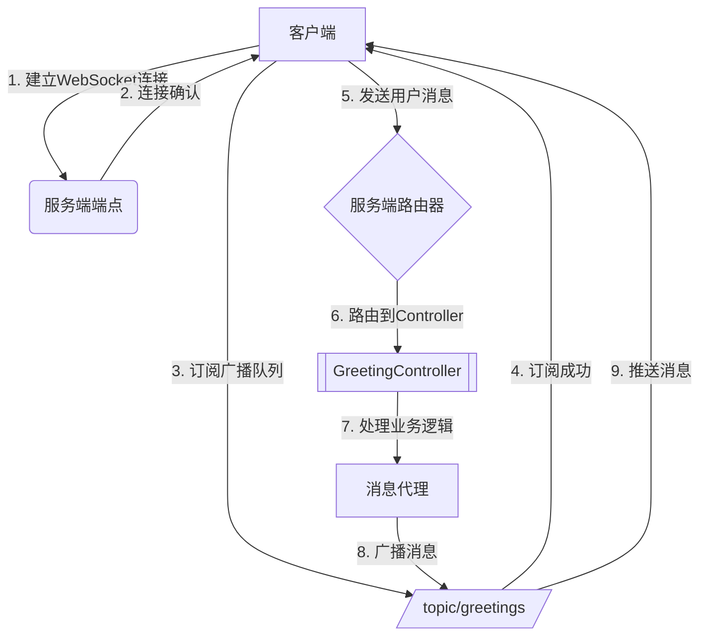

```mermaid
graph TD
    A[客户端] -->|1. 建立WebSocket连接| B(服务端端点)
    B -->|2. 连接确认| A
    A -->|3. 订阅广播队列| C[/topic/greetings/]
    C -->|4. 订阅成功| A
    A -->|5. 发送用户消息| D{服务端路由器}
    D -->|6. 路由到Controller| E[[GreetingController]]
    E -->|7. 处理业务逻辑| F[消息代理]
    F -->|8. 广播消息| C
    C -->|9. 推送消息| A
```

TODO

1. 通过所有的拦截器，搞个日志，让用户更好理解执行顺序
